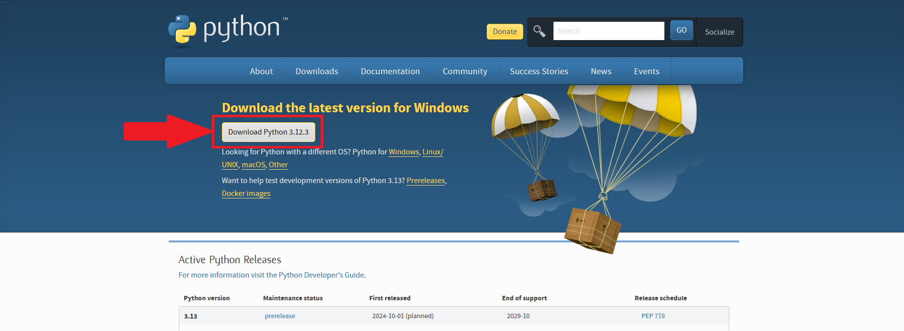
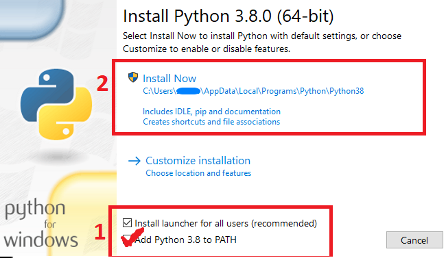

# RCParser

      ,  ,  , , ,
     <(__)> | | |
     | \/ | \_|_/
     \^  ^/   |
     /\--/\  /|
    /  \/  \/ |    Sneylis

<h1>установка</h1>

1 Скачайте git репозиторий и перейдите в папку где его установили с помощью cmd

2 Установите Python (https://www.python.org/downloads/)

3 во время установки Python поставте галочку

4 Запустите CMD и выполните команду

<code>cd RedCheckParser</code>
 
<code>pip install -r requirements. txt</code>
 

5 так же в терминале запускаем 

<code>python main.py</code>
<h2>P.S</h2>
 
 Пока что без граф оболочки придёться перекидывать файлы pdf в папку "RedCheckParser" и вводить полное название pdf файла вручную 

